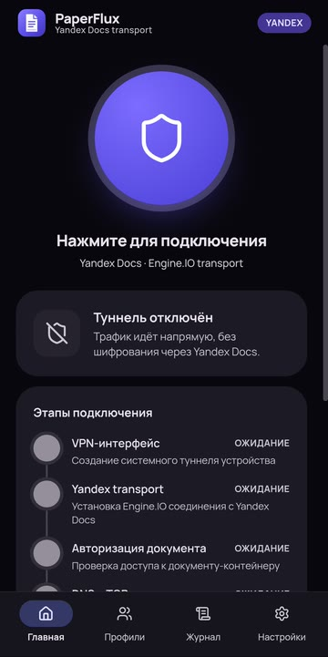
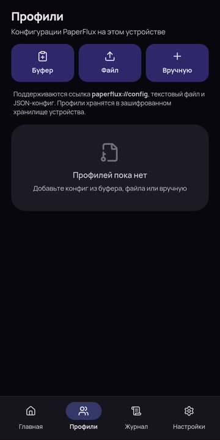
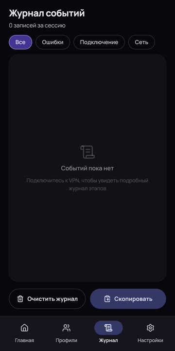
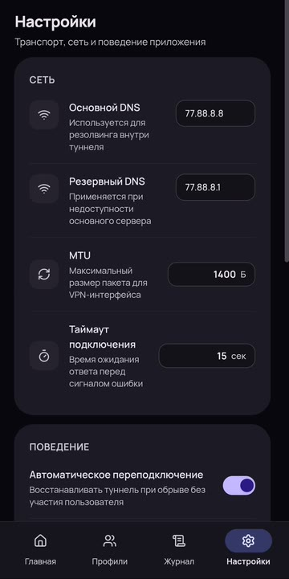

<p align="center">
  
</p>

<h1 align="center">PaperFlux Android</h1>

<p align="center"><b>Android VPN client with Yandex Docs transport</b></p>

<p align="center">
  
  
  
</p>

<p align="center"><a href="README.en.md">English</a> · <a href="README.md">Русский</a></p>

PaperFlux Android is a VPN client that connects to a PaperFlux server through Yandex Docs. It includes connection profiles, per-app exclusions, traffic statistics and an event journal.

To connect, scan a QR code with the built-in camera scanner, import a configuration from the clipboard or a file, or enter the parameters manually. The profile supplies the server and document URL.

## Interface

<div align="center">
  
  
  
  
</div>
<p align="center"><sub>Home · Profiles · Journal · Settings</sub></p>

## Features

- Android VPN service with session traffic counters and a persistent event journal.
- Profiles with selection, editing and deletion; QR, clipboard and file import or manual entry.
- An in-app QR scanner with a flashlight. Decoding is local, without Google Lens or Google Play Services; images are neither stored nor uploaded.
- Per-app exclusions: selected applications bypass the VPN. Reconnect after changing the list.
- Yandex Docs transport with authenticated tunnel readiness checks and reconnection handling.
- Foreground notification with connection state, traffic totals and a disconnect action.
- Profile secrets stored in encrypted device storage.

## Requirements

- Android 8.0 or later.
- `arm64-v8a`, `armeabi-v7a`, `x86`, or `x86_64` architecture.
- A compatible PaperFlux server and a valid connection profile.

[Download APK releases](https://github.com/Flofyyk/PaperFluxAndroid/releases)

Choose **universal** if unsure about your device architecture. Architecture-specific APKs provide the same features in a smaller download. ARM64 has been tested on a physical device; other ABIs have build and packaging checks only.

## Transports and recovery

Android 0.4.14 requires PaperFlux Server 0.5.6 with `--session`; update both sides. Session uses batched/zstd and is not interchangeable with the legacy PFS2 protocol.

The interface lists Yandex once, alongside Cups.online and Mail.ru Docs. Imported profiles retain their underlying Yandex protocol type. Volga profiles still require a separate empty document because that transport modifies document content.

Manual Yandex verification buttons have been removed from the interface and notification. Internal cookie/service authorization compatibility remains, but Session does not bypass Yandex CAPTCHA requirements: an access challenge may prevent a connection until resolved. The service channel is not used for regular VPN traffic. See [server transport configuration](https://github.com/Flofyyk/PaperFlux/blob/main/docs/TRANSPORTS.md).

A restored document channel triggers an immediate DNS/TCP check. Restarted servers must answer a fresh cryptographic challenge before replacing the peer session. Brief interruptions no longer force an unnecessary VPN restart, and repeated service starts preserve foreground status.

## Installation and connection

1. Download the APK from the [latest release](https://github.com/Flofyyk/PaperFluxAndroid/releases/latest) and install it.
2. Open Profiles and scan a QR code, import a configuration from the clipboard or a file, or enter it manually.
3. Select a profile and tap the connect button on the home screen.
4. On first connection, approve the Android VPN permission dialog.

To bypass the VPN for specific apps, select them under Settings → App exclusions and reconnect.

The matching server source is in [PaperFlux Server](https://github.com/Flofyyk/PaperFlux). The project started from [p1neappleXpress/OpenFlux](https://github.com/p1neappleXpress/OpenFlux); PaperFlux Android is maintained as a separate client.

## Build from source

Requirements: Android SDK 35, JDK 17+, and Node.js 20.19+ or 22.12+. UI sources are included in `web/`; Gradle installs locked dependencies and builds them. Four native ABI binaries are included. Rebuilding them requires Go 1.26.4+ and NDK 27.0.12077973+, using `scripts/build-android-native.ps1` in the server repository.

```bash
./gradlew :app:assembleDebug
adb install -r app/build/outputs/apk/debug/app-universal-debug.apk
```

## Disclaimer

PaperFlux is experimental research software provided **as is**, without warranties or guarantees of availability, privacy, security, performance, or fitness for a particular purpose. The authors do not operate a service, provide access credentials, or take responsibility for how the software is configured or used.

Use it only for education, research, and testing on systems, documents, servers, and networks you own or are explicitly authorized to use. You are solely responsible for legal compliance, configuration security, data handling, and all traffic generated by your installation.

## License

PaperFlux Android follows the OpenFlux project license. See [LICENSE](https://github.com/p1neappleXpress/OpenFlux/blob/main/LICENSE) and the companion server repository for third-party notices.
