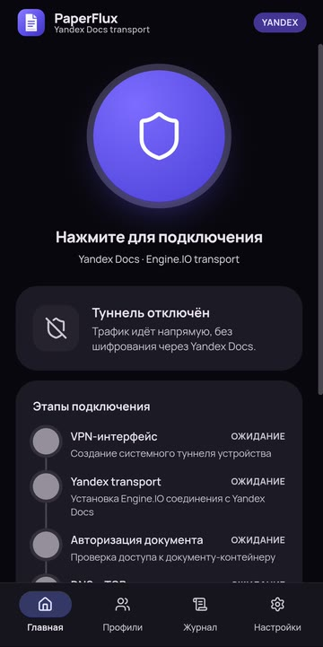
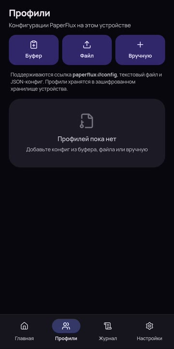
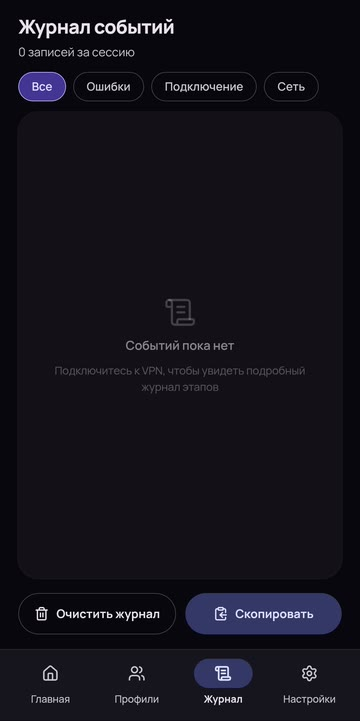
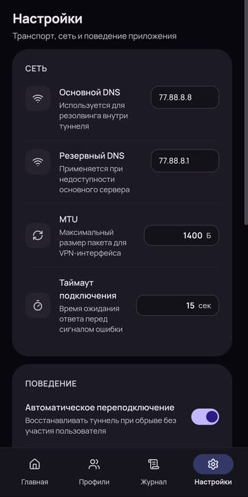

# PaperFlux Android

<p align="center">
  
</p>

<h1 align="center">PaperFlux Android</h1>

<p align="center"><b>Экспериментальный Android-клиент для исследования документного транспорта</b></p>

<p align="center">
  
  
  
  
</p>

<p align="center"><a href="README.md">English</a> · <b>Русский</b></p>

PaperFlux Android — экспериментальный клиент для изучения документного сетевого транспорта на устройствах, которыми вы управляете. В нём нет готового сервера, документа, подписки или конфигурации доступа: все параметры добавляет локально человек, проводящий эксперимент.

## Интерфейс

<div align="center">
  
  
  
  
</div>
<p align="center"><sub>Экраны приложения без системных строк Android.</sub></p>

## Возможности

- Системный Android VPN с учётом времени и трафика сессии и сохраняемым журналом событий.
- Профили: выбор, редактирование, удаление, импорт из буфера, файла и ручной ввод.
- Исключения приложений: выбранные приложения работают в обход VPN. После изменения списка нужно переподключиться.
- Транспорт Yandex Docs с проверкой готовности защищённого канала и восстановлением соединения.
- Уведомление со статусом, счётчиками трафика и кнопкой отключения.
- Хранение секретов профиля в зашифрованном хранилище устройства.

## Совместимость и ограничения

Готовая сборка рассчитана на Android 8+ и ARM64. Нужны совместимый PaperFlux Server и действующий профиль: сама ссылка на документ не предоставляет доступ к серверу. Android-клиент использует один документ на подключение; объединение нескольких каналов пока не включено. Смена сети и недоступность Яндекса могут прерывать сессию. Версия остаётся экспериментальной.

[Скачать APK из релизов](https://github.com/Flofyyk/PaperFluxAndroid/releases)

## Начало работы

1. Соберите или подготовьте совместимый PaperFlux Server для инфраструктуры, которой вы администрируете.
2. Установите APK на устройство `arm64-v8a` с Android 8.0 или новее.
3. Импортируйте собственную конфигурацию и запустите тестовую сессию из приложения.

Исходный код серверной части находится в [PaperFlux Server](https://github.com/Flofyyk/PaperFlux). Проект основан на [p1neappleXpress/OpenFlux](https://github.com/p1neappleXpress/OpenFlux); PaperFlux Android поддерживается как отдельный клиент.

## Сборка из исходников

Нужны Android SDK 35, JDK 17 и Android NDK 27.0.12077973+ для пересборки native-кода.

```bash
./gradlew :app:assembleDebug
adb install -r app/build/outputs/apk/debug/app-debug.apk
```

## Отказ от ответственности

PaperFlux — экспериментальное исследовательское ПО, которое предоставляется «как есть», без гарантий доступности, приватности, безопасности, производительности или пригодности для какой-либо цели. Авторы не предоставляют сервис, доступы или готовые конфигурации и не отвечают за настройку и использование программы.

Используйте проект только для обучения, исследований и тестов на собственных либо явно разрешённых системах, документах, серверах и сетях. За соблюдение законов, безопасность конфигурации, работу с данными и весь трафик, созданный вашей установкой, отвечаете вы.

## Лицензия

PaperFlux Android следует лицензии OpenFlux. См. [LICENSE](https://github.com/p1neappleXpress/OpenFlux/blob/main/LICENSE) и уведомления о сторонних лицензиях в серверном репозитории.
